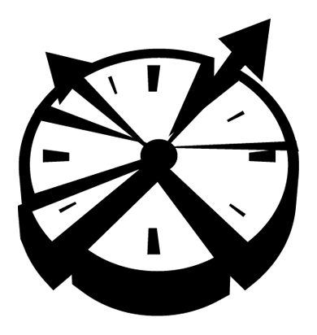

### Broken Clock Website

🌐 You can access the website at: [https://www.brokenclock.fun](https://www.brokenclock.fun)

## 💡 About
This was my first deep experience with web development, where I had the opportunity to learn many things I wasn't familiar with. In this project, I used Next.js, a framework that inspired me a lot, along with Tailwind CSS, which was love at first sight for me. 

This project is essentially the website for my game group on the Roblox platform, where I integrated the Roblox API to obtain the number of players in each of the games.

 

  

